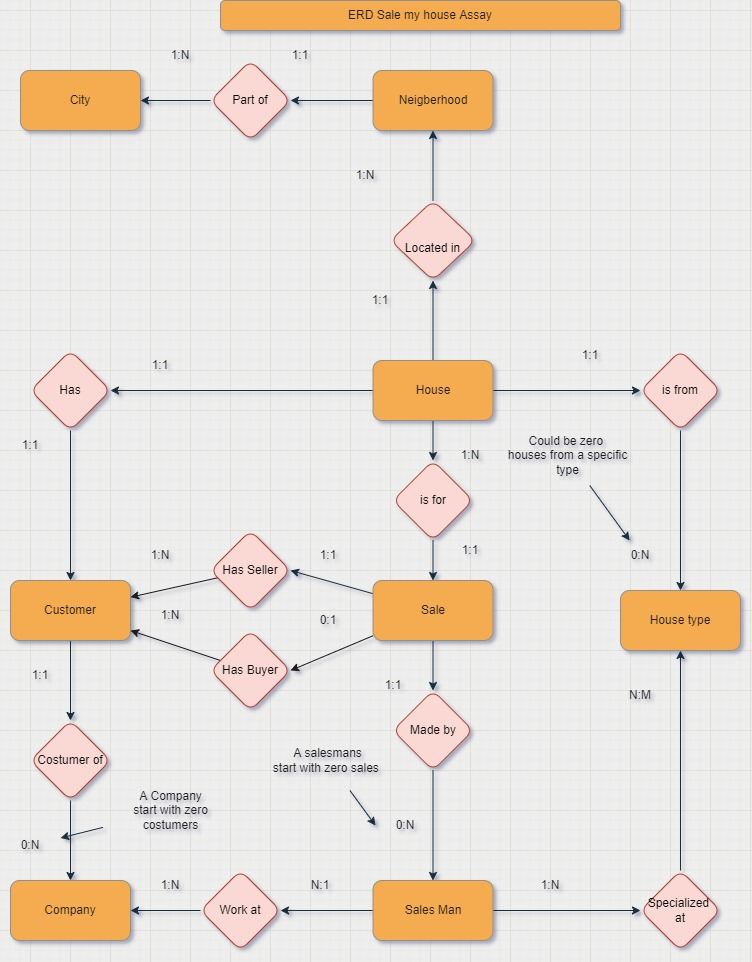
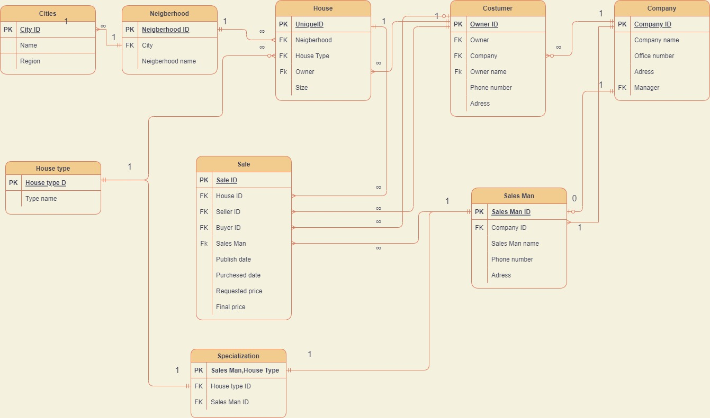

# Sale My House SQL Assay

In this assay i made both Table Schema and ERD Diargram for a real estate company software's Data Base according to client's requirements

 <h2>ERD</h2>
 
 

  

 <h2>Table Schema</h2>
 
 

## SQL Script
### Prerequisites for the script

in order to run the script you need to make sure you dont have DB named `[Sale My House DB]`
if so choose diffrent name  and run
https://github.com/itayG98/Sale-My-House/blob/a4beabf97051b155d9e6f5df4899bf24fe319773/FinalyAssay.sql#L1-L5

Right after this it will run the script to build the tables isert initial data and run 5 queries

### Queries
 
1. `Revenue of the company from each house type yearly grouped`
https://github.com/itayG98/Sale-My-House/blob/a4beabf97051b155d9e6f5df4899bf24fe319773/FinalyAssay.sql#L261-L274
2. `Display custumers who sold house and bought more expensive house`
https://github.com/itayG98/Sale-My-House/blob/a4beabf97051b155d9e6f5df4899bf24fe319773/FinalyAssay.sql#L278-L317
3. `Display the average of each Neigberhood order by Most expensive`
https://github.com/itayG98/Sale-My-House/blob/a4beabf97051b155d9e6f5df4899bf24fe319773/FinalyAssay.sql#L321-L336
4. `Display the best employee by revenue for each year `
https://github.com/itayG98/Sale-My-House/blob/a4beabf97051b155d9e6f5df4899bf24fe319773/FinalyAssay.sql#L339-L373
5. `Offer a bigger house to a custumer which bought a house from 2 years ago and farther in the same city`
https://github.com/itayG98/Sale-My-House/blob/a4beabf97051b155d9e6f5df4899bf24fe319773/FinalyAssay.sql#L376-L430
